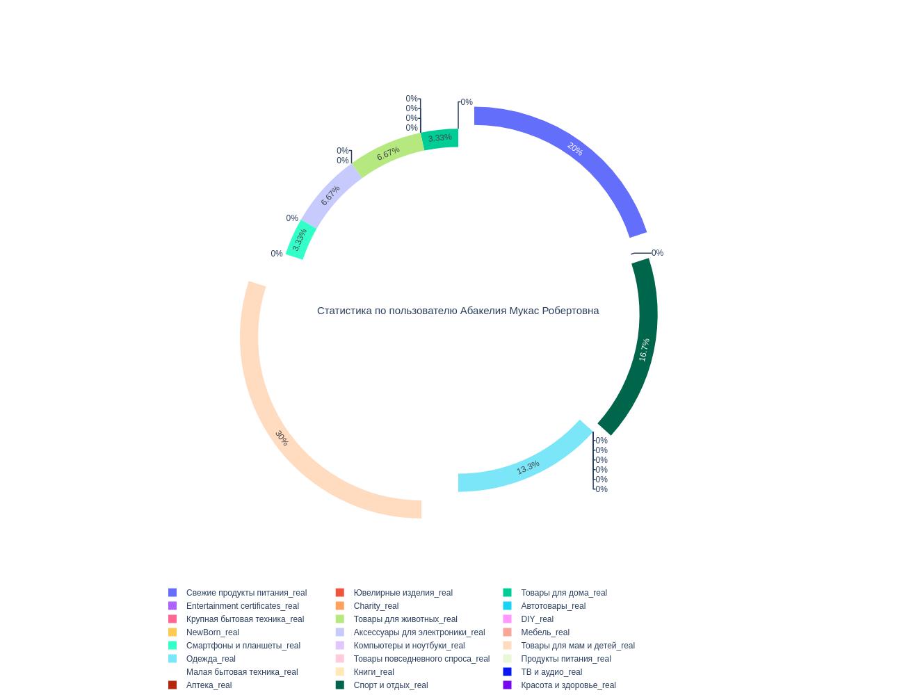

# recomendation_system(for Hackathon)

recommendation/  
│  
├── data/  
│ ├── bd.csv - база данных в формате csv, которая используется в проекте  
│ ├── category.csv - названия колонок для БД  
│ └── final_dataset.csv - максимально выжатая информация из датасета  
│ └── Peop_Hist.csv - история о чеках каждого пользователя  
│
├── img/  
│ ├── newplot.png - диаграмма - пример статистики о пользователя
│
├── src/  
├── analiz/
│ ├── people_analiz.ipynb - итерактивная статистика по введенному пользователю  
├── back/  
│ ├── ServerFunc.ipynb - прием чека на сервер  
│ ├── BackFunc.ipynb - функции для бэкенда  
├── dataset/  
│ ├── cash.ipynb - составление полного датасета + дообучение модели  
│ ├── dataset_to_bd.ipynb - сбор только нужной информации для БД  
├── model/  
│ ├── NLP.ipynb - сбор нужного датасета для обучения модели + обучение модели  
│ ├── word2vec - модель  

В people_analiz не отобразилась диграмма при загрузке в github, поэтому покажу ее здесь(Информация по каталогам определенного пользователя)

